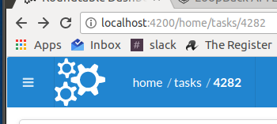
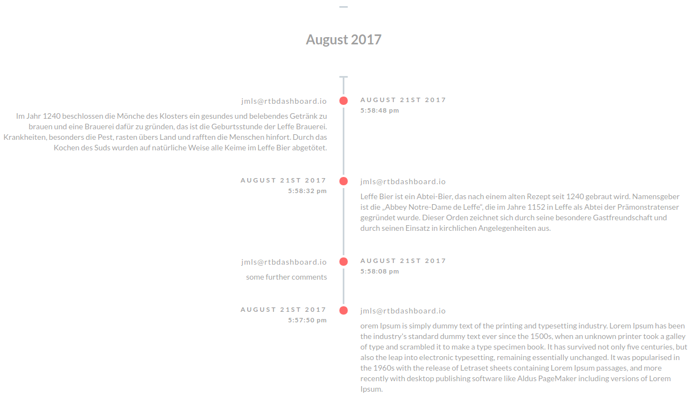

# @nodeableio/ngx-ui is a small collection of angular 4+ components

## [ngx-breadcrumbs](src/modules/breadcrumbs/README.md)

A component that creates a breadcrumbs trail. It hooks into the angular router,
and dynamically builds up a breadcrumbs trail

## [ngx-timeline](src/modules/timeline/README.md)

This is an angular 4+ component that creates a vertical timeline of events

It uses css based on css written by
[Brady Wright](http://codepen.io/phasethree/pen/NNOvrW)

Also checkout the awesome
[ng2-semantic-ui](https://github.com/edcarroll/ng2-semantic-ui) project for
loads of other components)

## Dependencies

* [Angular](https://angular.io) (^6.0.0)
* [Semantic UI CSS](http://semantic-ui.com/) (^2.2.13) (jQuery is **not**
  required)

## Want to help?

Want to file a bug, contribute some code, or improve documentation? Great!
Please read the [contributing guidelines](./CONTRIBUTING.md) to get going.

## Development

# NgxUiApp

This project was generated with
[Angular CLI](https://github.com/angular/angular-cli) version 6.0.5.

## Development server

Run `ng serve` for a dev server. Navigate to `http://localhost:4200/`. The app
will automatically reload if you change any of the source files.

## Code scaffolding

Run `ng generate component component-name` to generate a new component. You can
also use `ng generate directive|pipe|service|class|guard|interface|enum|module`.

## Build

Run `ng build` to build the project. The build artifacts will be stored in the
`dist/` directory. Use the `--prod` flag for a production build.

## Running unit tests

Run `ng test` to execute the unit tests via
[Karma](https://karma-runner.github.io).

## Running end-to-end tests

Run `ng e2e` to execute the end-to-end tests via
[Protractor](http://www.protractortest.org/).

## Further help

To get more help on the Angular CLI use `ng help` or go check out the
[Angular CLI README](https://github.com/angular/angular-cli/blob/master/README.md).
